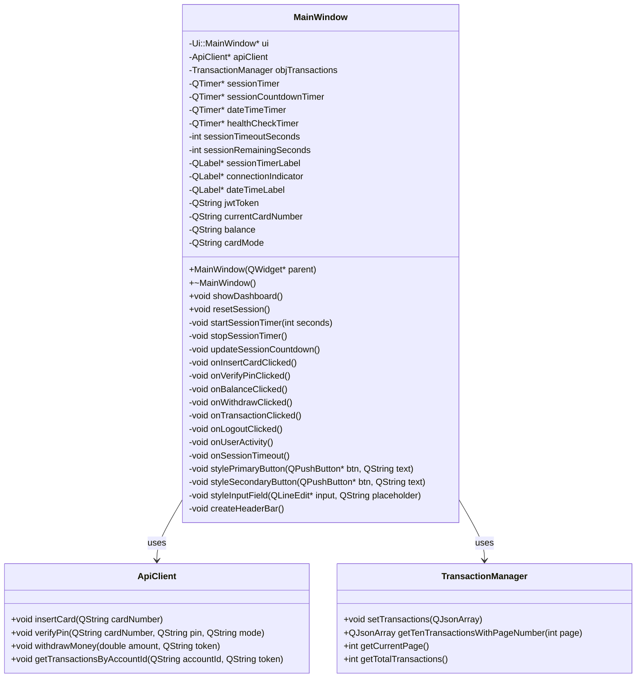
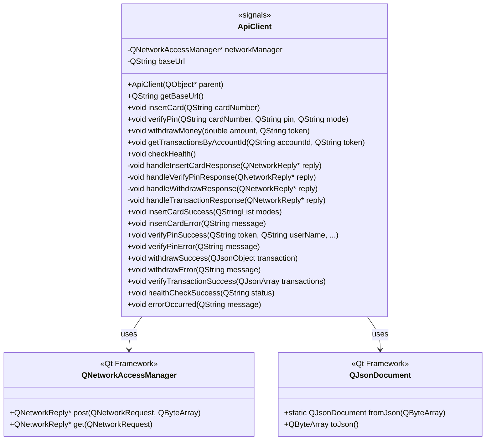
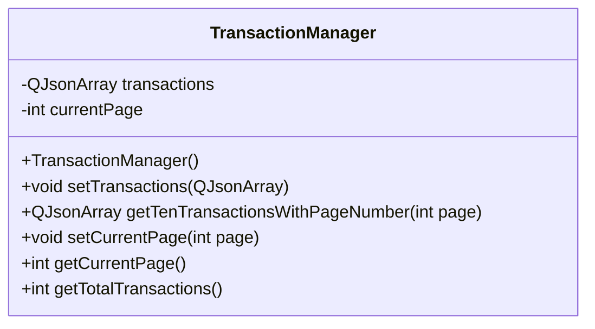
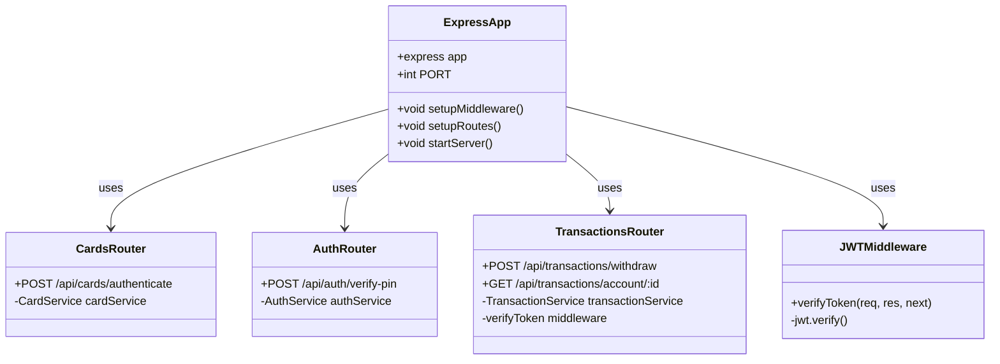
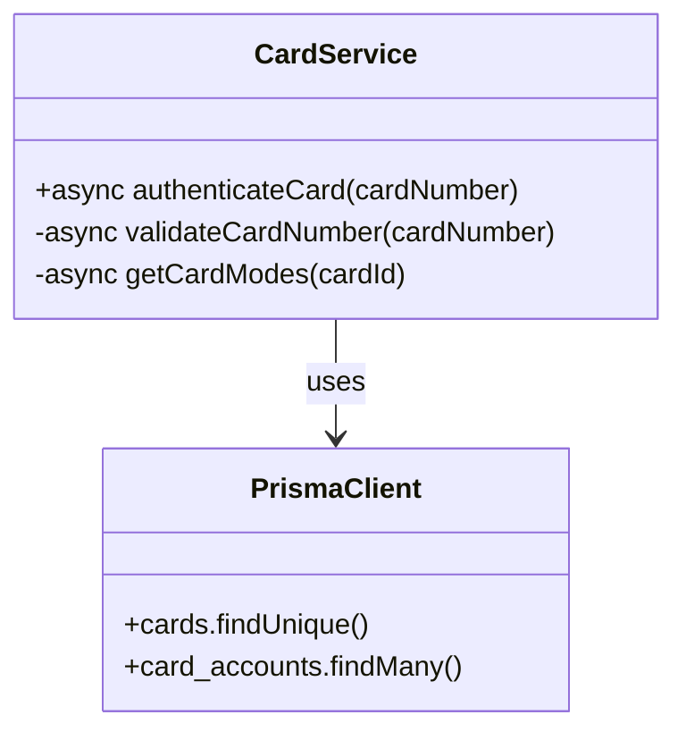
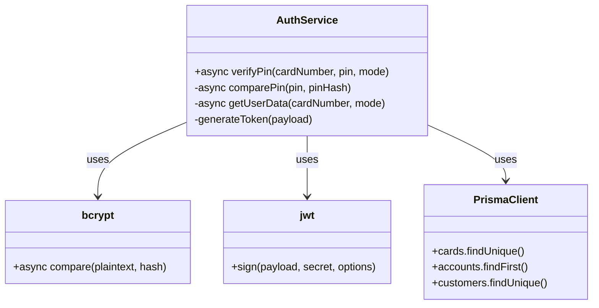
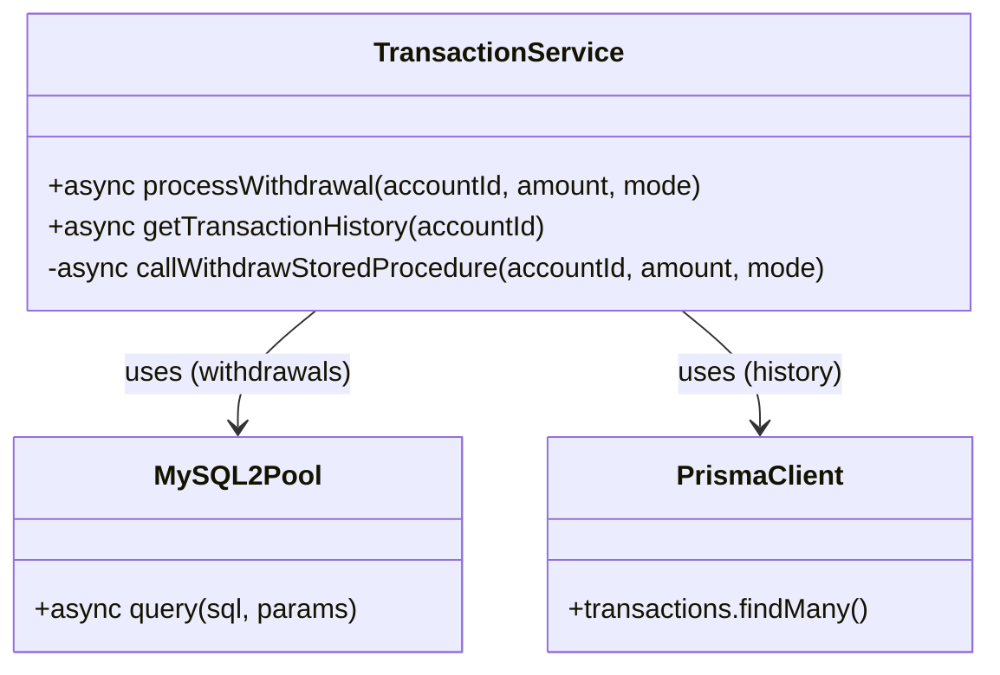

# Komponenttien Kuvaukset / Component Descriptions

Tämä dokumentti sisältää yksityiskohtaiset kuvaukset järjestelmän pääkomponenteista. Jokainen komponentti on kuvattu omalla sivullaan.

This document contains detailed descriptions of the system's main components. Each component is described on its own page.

---

## Sisällysluettelo / Table of Contents

**Frontend Components:**
1. [MainWindow](#1-mainwindow)
2. [ApiClient](#2-apiclient)
3. [TransactionManager](#3-transactionmanager)

**Backend Components:**
4. [Express Application](#4-express-application)
5. [Card Service](#5-card-service)
6. [Auth Service](#6-auth-service)
7. [Transaction Service](#7-transaction-service)

---

# 1. MainWindow

## Komponentin nimi / Component Name
**MainWindow** (Qt QMainWindow)

## Tarkoitus ja toiminta / Purpose and Operation

MainWindow is the main UI controller for the ATM desktop application. It manages all user interactions across 6 different views (card insertion, PIN entry, dashboard, balance, transaction history, withdraw) using a QStackedWidget. The component applies a consistent pink theme (#FFB6D9, #FF85C0, #FFE5EC) across all pages and handles session timeout management (10s for PIN entry, 30s for dashboard).

Key responsibilities:
- UI state navigation and view management
- User input handling and validation
- Session timer management (automatic logout after inactivity)
- Pink theme styling application
- Connection status monitoring (Azure backend health check)

## Järjestelmäkomponentti / System Component

**Desktop Application** - Qt 6.8.1 Widgets-based C++17 executable

- Type: Native Windows desktop application
- Framework: Qt Widgets
- Build: CMake + Ninja
- Deployment: Standalone .exe (no installation required)

## Luokkakaavio (UML) / Class Diagram



## Rajapinnat / Interfaces

### Signaalit ja Slotit / Signals and Slots (Self-implemented, excluding Qt internals)

| Funktio / Signaali | Tarkoitus / Purpose |
|-------------------|---------------------|
| `void showDashboard()` | Navigates to dashboard view (index 2) |
| `void resetSession()` | Clears all session data (token, balance, card number) and returns to card insertion page |
| `void onInsertCardClicked()` | Handles card insertion button click, sends card number to ApiClient |
| `void onInsertCardSuccess(QStringList modes)` | Receives available card modes from backend, populates mode selector, starts 10s session timer |
| `void onVerifyPinClicked()` | Validates PIN length (4 digits), sends verification request to backend |
| `void onVerifyPinSuccess(QString token, QString userName, ...)` | Stores JWT token, updates dashboard labels, starts 30s session timer |
| `void onBalanceClicked()` | Displays account balance page with credit limit (if CREDIT mode) |
| `void onWithdrawClicked()` | Navigates to withdrawal page (index 5) |
| `void onWithdrawSubmitClicked()` | Validates withdrawal amount, sends request to backend |
| `void onWithdrawSuccess(QJsonObject transaction)` | Updates balance, displays success message, returns to dashboard |
| `void onTransactionClicked()` | Fetches transaction history from backend, displays in QTableWidget |
| `void onTransactionSuccess(QJsonArray transactions)` | Populates transaction table with paginated data (10 per page) |
| `void onLogoutClicked()` | Calls `resetSession()` to clear session and return to start |
| `void onUserActivity()` | Resets session timer when user interacts with UI (prevents timeout) |
| `void onSessionTimeout()` | Displays timeout dialog, calls `resetSession()` after inactivity |
| `void startSessionTimer(int seconds)` | Starts countdown timer with specified duration (10s or 30s) |
| `void updateDateTime()` | Updates header datetime label every second (Finnish format: dd.MM.yyyy HH:mm) |
| `void checkConnectionStatus()` | Polls backend /health endpoint every 30 seconds, updates connection indicator |

### Theme Styling Functions

| Funktio | Tarkoitus / Purpose |
|---------|---------------------|
| `void stylePrimaryButton(QPushButton*, QString)` | Applies pink gradient style to action buttons (Insert, Verify, Withdraw) |
| `void styleSecondaryButton(QPushButton*, QString)` | Applies outlined style to dashboard action buttons |
| `void styleCancelButton(QPushButton*, QString)` | Applies light style to cancel/back buttons |
| `void styleInputField(QLineEdit*, QString)` | Applies pink-themed input field styling with focus effects |
| `void styleErrorLabel(QLabel*)` | Applies error text styling (#E91E63 color) |
| `void createHeaderBar()` | Creates persistent header with connection status, datetime, ATM serial, session timer |

## Vastuuhenkilö(t) / Responsible Person(s)

**Suunnittelu / Design:** Topi Pietilänaho, Iisa Metsola  
**Toteutus / Implementation:** Topi Pietilänaho  
**Testaus / Testing:** Tommy Näsänen, Iisa Metsola  
**Dokumentointi / Documentation:** Iisa Metsola

---

# 2. ApiClient

## Komponentin nimi / Component Name
**ApiClient** (Qt QObject)

## Tarkoitus ja toiminta / Purpose and Operation

ApiClient is the HTTP communication layer between the Qt frontend and the Azure Node.js backend. It handles all REST API requests using QNetworkAccessManager, manages JWT token authentication, and parses JSON responses. The component uses Qt's signal-slot mechanism for asynchronous callbacks.

Key responsibilities:
- HTTPS REST API communication (TLS 1.2+)
- JWT token management
- JSON request/response serialization
- Asynchronous request handling
- Error handling and timeout management

API Base URL: `https://bank-atm-backend-h5bybufaegbnbvaf.swedencentral-01.azurewebsites.net`

## Järjestelmäkomponentti / System Component

**Qt Network Library Component** - QObject-based HTTP client

- Type: Qt QObject (signal-emitting component)
- Network: QNetworkAccessManager (HTTPS)
- Data Format: JSON (QJsonDocument)
- Authentication: JWT tokens (Bearer scheme)

## Luokkakaavio (UML) / Class Diagram



## Rajapinnat / Interfaces

### Public Methods (Provides to MainWindow)

| Funktio | Tarkoitus / Purpose |
|---------|---------------------|
| `void insertCard(QString cardNumber)` | Sends card number to `/api/cards/authenticate`, validates card exists |
| `void verifyPin(QString cardNumber, QString pin, QString mode)` | Sends PIN verification to `/api/auth/verify-pin`, receives JWT token |
| `void withdrawMoney(double amount, QString token)` | Sends withdrawal request to `/api/transactions/withdraw` with JWT |
| `void getTransactionsByAccountId(QString accountId, QString token)` | Fetches transaction history from `/api/transactions/account/:id` |
| `void checkHealth()` | Pings `/health` endpoint to wake up Azure App Service |
| `QString getBaseUrl()` | Returns Azure backend base URL |

### Signals (Emitted to MainWindow)

| Signaali | Tarkoitus / Purpose |
|----------|---------------------|
| `void insertCardSuccess(QStringList modes)` | Emits available card modes (DEBIT/CREDIT) on successful card validation |
| `void insertCardError(QString message)` | Emits error message if card not found or invalid |
| `void verifyPinSuccess(QString token, QString userName, QString customerId, ...)` | Emits JWT token and user data on successful PIN verification |
| `void verifyPinError(QString message)` | Emits error if PIN incorrect or other auth failure |
| `void withdrawSuccess(QJsonObject transaction)` | Emits transaction details with new balance after successful withdrawal |
| `void withdrawError(QString message)` | Emits error if insufficient funds or withdrawal fails |
| `void verifyTransactionSuccess(QJsonArray transactions)` | Emits array of transactions for display |
| `void healthCheckSuccess(QString status)` | Emits "OK" status from backend health check |
| `void errorOccurred(QString message)` | Generic error signal for network/parsing errors |

### REST API Endpoints Used

| Endpoint | Method | Purpose |
|----------|--------|---------|
| `/health` | GET | Azure backend health check |
| `/api/cards/authenticate` | POST | Card number validation |
| `/api/auth/verify-pin` | POST | PIN verification + JWT generation |
| `/api/transactions/withdraw` | POST | Withdrawal processing (requires JWT) |
| `/api/transactions/account/:id` | GET | Transaction history (requires JWT) |

## Vastuuhenkilö(t) / Responsible Person(s)

**Suunnittelu / Design:** Tommy Näsänen, Topi Pietilänaho  
**Toteutus / Implementation:** Tommy Näsänen  
**Testaus / Testing:** Iisa Metsola  
**Dokumentointi / Documentation:** Topi Pietilänaho

---

# 3. TransactionManager

## Komponentin nimi / Component Name
**TransactionManager** (C++ Class)

## Tarkoitus ja toiminta / Purpose and Operation

TransactionManager is a pagination helper that manages transaction history data locally in the frontend. It caches transaction data received from the backend and provides paginated access (10 transactions per page) for display in the QTableWidget.

Key responsibilities:
- Local transaction data caching
- Pagination logic (10 transactions per page)
- Page navigation tracking
- Data slicing for table display

## Järjestelmäkomponentti / System Component

**C++ Helper Class** - In-memory data manager

- Type: Standard C++ class (non-Qt)
- Storage: QJsonArray (in-memory cache)
- Lifetime: Session-scoped (cleared on logout)

## Luokkakaavio (UML) / Class Diagram



## Rajapinnat / Interfaces

### Public Methods

| Funktio | Tarkoitus / Purpose |
|---------|---------------------|
| `void setTransactions(QJsonArray)` | Stores full transaction array received from backend, resets page to 1 |
| `QJsonArray getTenTransactionsWithPageNumber(int page)` | Returns slice of 10 transactions for specified page number |
| `void setCurrentPage(int page)` | Updates current page number (for pagination controls) |
| `int getCurrentPage()` | Returns current page number (starts at 1) |
| `int getTotalTransactions()` | Returns total number of transactions in cache |

### Data Format (JSON Structure)

```json
{
  "transactionType": "WITHDRAW",
  "amount": "50.00",
  "balanceAfter": "440.00",
  "createdAt": "2025-01-20T10:30:00.000Z"
}
```

## Vastuuhenkilö(t) / Responsible Person(s)

**Suunnittelu / Design:** Iisa Metsola  
**Toteutus / Implementation:** Iisa Metsola, Topi Pietilänaho  
**Testaus / Testing:** Tommy Näsänen  
**Dokumentointi / Documentation:** Iisa Metsola

---

# 4. Express Application

## Komponentin nimi / Component Name
**Express Application** (Node.js HTTP Server)

## Tarkoitus ja toiminta / Purpose and Operation

The Express Application is the main HTTP server component running on Azure App Service. It manages all incoming REST API requests from the Qt frontend, coordinates middleware (JWT authentication, CORS, logging), and routes requests to appropriate service components. The application uses a layered architecture with routers, middleware, services, and database access layers.

Key responsibilities:
- HTTP server management (port 8080)
- Route registration and middleware chain execution
- Global error handling
- CORS configuration for Qt client
- Request/response logging (Morgan)

## Järjestelmäkomponentti / System Component

**Node.js Web Application** - Azure App Service

- Runtime: Node.js 20.x
- Framework: Express 4.x
- Deployment: Azure App Service (Basic B1 tier)
- Port: 8080
- HTTPS: Azure-managed SSL/TLS

## Luokkakaavio (UML) / Class Diagram



## Rajapinnat / Interfaces

### Public Endpoints (Provides to Qt Client)

| Endpoint | Method | Authentication | Purpose |
|----------|--------|---------------|---------|
| `GET /health` | GET | None | Health check (wakes up Azure App Service from sleep) |
| `POST /api/cards/authenticate` | POST | None | Card number validation, returns available modes |
| `POST /api/auth/verify-pin` | POST | None | PIN verification, returns JWT token |
| `POST /api/transactions/withdraw` | POST | JWT required | Process withdrawal using stored procedure |
| `GET /api/transactions/account/:id` | GET | JWT required | Fetch transaction history via Prisma |
| `GET /api/customers` | GET | None | Development endpoint (list all customers) |

### Middleware Chain

| Middleware | Order | Purpose |
|------------|-------|---------|
| `cors()` | 1 | Enable CORS for Qt client origin |
| `express.json()` | 2 | Parse JSON request bodies (10mb limit) |
| `morgan('combined')` | 3 | HTTP request logging |
| `verifyToken` | 4 | JWT validation on protected routes |
| `errorMiddleware` | 5 | Global error handler (catches all errors) |

### Configuration

```javascript
{
  "port": 8080,
  "cors": {
    "origin": "*",
    "methods": ["GET", "POST", "PUT", "DELETE"]
  },
  "bodyParser": {
    "limit": "10mb"
  },
  "jwt": {
    "algorithm": "HS256",
    "expiresIn": "1h"
  }
}
```

## Vastuuhenkilö(t) / Responsible Person(s)

**Suunnittelu / Design:** Tommi Lipponen, Tommy Näsänen  
**Toteutus / Implementation:** Tommi Lipponen  
**Testaus / Testing:** Tommy Näsänen, Topi Pietilänaho  
**Dokumentointi / Documentation:** Tommi Lipponen

---

# 5. Card Service

## Komponentin nimi / Component Name
**Card Service** (Node.js Service Layer)

## Tarkoitus ja toiminta / Purpose and Operation

Card Service handles card validation and card-account relationship lookups using Prisma ORM. It validates that a card number exists in the database, checks if the card is active (not blocked), and retrieves available card modes (DEBIT/CREDIT) based on the card_accounts junction table.

Key responsibilities:
- Card number validation (16-digit format)
- Card status verification (ACTIVE vs BLOCKED)
- Available card modes detection (DEBIT/CREDIT)
- Card-account relationship queries via Prisma

## Järjestelmäkomponentti / System Component

**Node.js Service Module** - Business logic layer

- Language: JavaScript (Node.js 20.x)
- ORM: Prisma Client
- Database Queries: Type-safe Prisma queries
- Error Handling: Async/await with try-catch

## Luokkakaavio (UML) / Class Diagram



## Rajapinnat / Interfaces

### Public Methods (Provides to Cards Router)

| Funktio | Tarkoitus / Purpose |
|---------|---------------------|
| `async authenticateCard(cardNumber)` | Validates card exists, is active, returns available modes (DEBIT/CREDIT) |

### Request/Response Format

**Input:**
```json
{
  "cardNumber": "1234567890123456"
}
```

**Output (Success):**
```json
{
  "success": true,
  "modes": ["DEBIT", "CREDIT"],
  "cardId": 1,
  "customerId": 42
}
```

**Output (Error):**
```json
{
  "success": false,
  "message": "Card not found or blocked"
}
```

### Database Queries (via Prisma)

```javascript
// Find card by card number
const card = await prisma.cards.findUnique({
  where: { card_number: cardNumber }
});

// Get available card modes
const cardModes = await prisma.card_accounts.findMany({
  where: { card_id: cardId },
  select: { card_mode: true }
});
```

## Vastuuhenkilö(t) / Responsible Person(s)

**Suunnittelu / Design:** Tommi Lipponen  
**Toteutus / Implementation:** Tommi Lipponen, Tommy Näsänen  
**Testaus / Testing:** Iisa Metsola  
**Dokumentointi / Documentation:** Tommy Näsänen

---

# 6. Auth Service

## Komponentin nimi / Component Name
**Auth Service** (Node.js Service Layer)

## Tarkoitus ja toiminta / Purpose and Operation

Auth Service handles PIN verification and JWT token generation. It uses bcrypt to compare hashed PINs stored in the database, aggregates user and account data via Prisma ORM, and generates JWT tokens with a 1-hour expiry for session management.

Key responsibilities:
- PIN verification (bcrypt comparison)
- JWT token generation (HS256 algorithm)
- User data aggregation (customer, account, balance, credit limit)
- Account mode selection (DEBIT vs CREDIT)

## Järjestelmäkomponentti / System Component

**Node.js Service Module** - Authentication & Authorization layer

- Language: JavaScript (Node.js 20.x)
- Password Hashing: bcrypt (cost factor: 10)
- JWT: jsonwebtoken library (HS256)
- ORM: Prisma Client

## Luokkakaavio (UML) / Class Diagram



## Rajapinnat / Interfaces

### Public Methods (Provides to Auth Router)

| Funktio | Tarkoitus / Purpose |
|---------|---------------------|
| `async verifyPin(cardNumber, pin, mode)` | Verifies PIN hash, generates JWT, returns user data + token |

### Request/Response Format

**Input:**
```json
{
  "cardNumber": "1234567890123456",
  "pin": "1234",
  "mode": "CREDIT"
}
```

**Output (Success):**
```json
{
  "token": "eyJhbGciOiJIUzI1NiIsInR5cCI6IkpXVCJ9...",
  "userData": {
    "customerId": 42,
    "userName": "Matti Meikäläinen",
    "accountId": 100,
    "accountNumber": "FI1234567890",
    "balance": "490.00",
    "creditLimit": "500.00"
  }
}
```

**Output (Error):**
```json
{
  "success": false,
  "message": "Invalid PIN"
}
```

### JWT Token Structure

```json
{
  "customerId": "42",
  "accountId": "100",
  "accountNumber": "FI1234567890",
  "cardMode": "CREDIT",
  "iat": 1674120000,
  "exp": 1674123600
}
```

**Token Lifetime:** 1 hour (3600 seconds)  
**Algorithm:** HS256 (HMAC with SHA-256)  
**Secret:** Stored in Azure App Service environment variable

### Security Features

- PIN never sent in plaintext (bcrypt hash comparison)
- JWT signed with secret key
- Token expiry enforced by middleware
- SQL injection prevention (Prisma parameterized queries)

## Vastuuhenkilö(t) / Responsible Person(s)

**Suunnittelu / Design:** Tommi Lipponen, Iisa Metsola  
**Toteutus / Implementation:** Tommi Lipponen  
**Testaus / Testing:** Tommy Näsänen  
**Dokumentointi / Documentation:** Tommi Lipponen

---

# 7. Transaction Service

## Komponentin nimi / Component Name
**Transaction Service** (Node.js Service Layer)

## Tarkoitus ja toiminta / Purpose and Operation

Transaction Service handles both withdrawal processing (via MySQL stored procedure) and transaction history retrieval (via Prisma ORM). It uses a hybrid database access approach: stored procedures for critical financial transactions (ACID guarantees, race condition prevention) and Prisma ORM for read operations.

Key responsibilities:
- Withdrawal processing via `withdraw_money` stored procedure
- Transaction history retrieval via Prisma ORM
- Balance validation (DEBIT: balance >= amount, CREDIT: balance + creditLimit >= amount)
- Atomic balance updates with transaction logging

## Järjestelmäkomponentti / System Component

**Node.js Service Module** - Business logic + Database access layer

- Language: JavaScript (Node.js 20.x)
- Withdrawals: MySQL2 Pool (stored procedure calls)
- History: Prisma Client (ORM queries)
- Database: Azure MySQL 8.0

## Luokkakaavio (UML) / Class Diagram



## Rajapinnat / Interfaces

### Public Methods (Provides to Transactions Router)

| Funktio | Tarkoitus / Purpose |
|---------|---------------------|
| `async processWithdrawal(accountId, amount, mode)` | Calls `withdraw_money` stored procedure, returns new balance + transaction |
| `async getTransactionHistory(accountId)` | Fetches transactions via Prisma, ordered by newest first |

### Withdrawal Request/Response

**Input:**
```json
{
  "amount": 50.0
}
```

**Output (Success):**
```json
{
  "balanceAfter": "440.00",
  "amount": "50.00",
  "transactionId": 123,
  "timestamp": "2025-01-20T10:30:00.000Z"
}
```

**Output (Error):**
```json
{
  "success": false,
  "message": "Insufficient funds for withdrawal"
}
```

### Stored Procedure Call

```sql
CALL withdraw_money(?, ?, ?)
-- Parameters: (accountId, amount, cardMode)
```

**Stored Procedure Benefits:**
- ✅ ACID transaction guarantee (BEGIN/COMMIT in one call)
- ✅ Row-level locking (`FOR UPDATE`) prevents race conditions
- ✅ Atomic balance update + transaction log insert
- ✅ Business logic encapsulation in database

### Transaction History Query

```javascript
const transactions = await prisma.transactions.findMany({
  where: { account_id: parseInt(accountId) },
  orderBy: { created_at: 'desc' }
});
```

**Response Format:**
```json
[
  {
    "transactionType": "WITHDRAW",
    "amount": "50.00",
    "balanceAfter": "440.00",
    "createdAt": "2025-01-20T10:30:00.000Z"
  }
]
```

### Business Rules

| Card Mode | Validation Rule |
|-----------|----------------|
| DEBIT | `balance >= amount` |
| CREDIT | `balance + creditLimit >= amount` |

**Monetary Values:** DECIMAL(10,2) - precise to 2 decimal places

## Vastuuhenkilö(t) / Responsible Person(s)

**Suunnittelu / Design:** Tommi Lipponen, Tommy Näsänen, Topi Pietilänaho  
**Toteutus / Implementation:** Tommi Lipponen, Tommy Näsänen  
**Testaus / Testing:** Iisa Metsola, Topi Pietilänaho  
**Dokumentointi / Documentation:** Topi Pietilänaho

---

## Viitteet / References

- **System Architecture:** See `docs/component-diagram.md`
- **API Documentation:** See `API_REFERENCE.md`
- **System Flowchart:** See `docs/system-flowchart.md`
- **Pink Theme Master Plan:** See `PINK_THEME_MASTER_PLAN.md`
- **Test Credentials:** See `TEST_CREDENTIALS.md`

**Dokumentti päivitetty / Document Updated:** 2025-01-20
