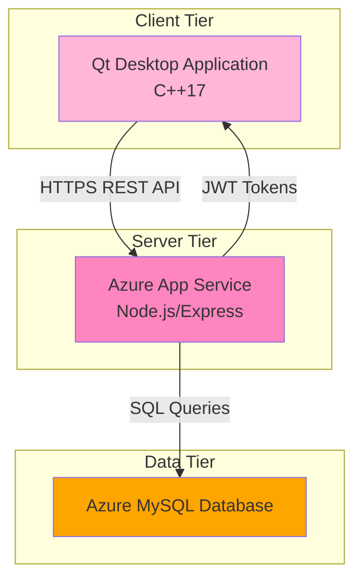
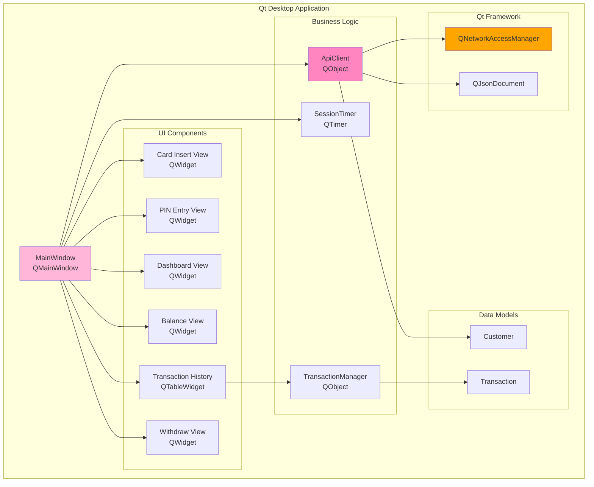
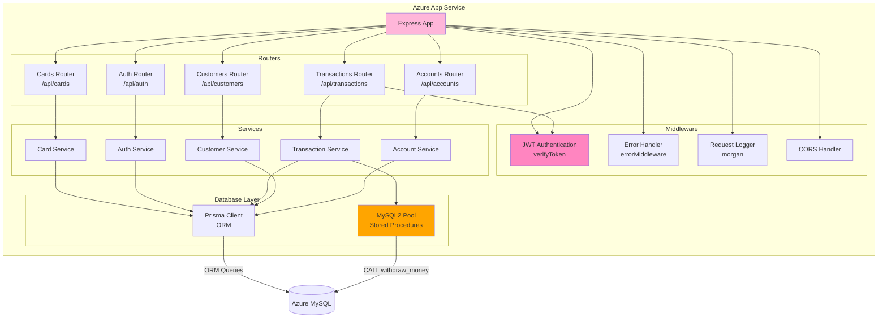
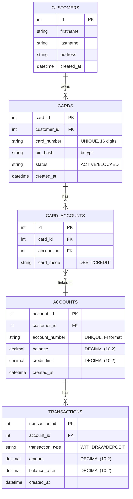
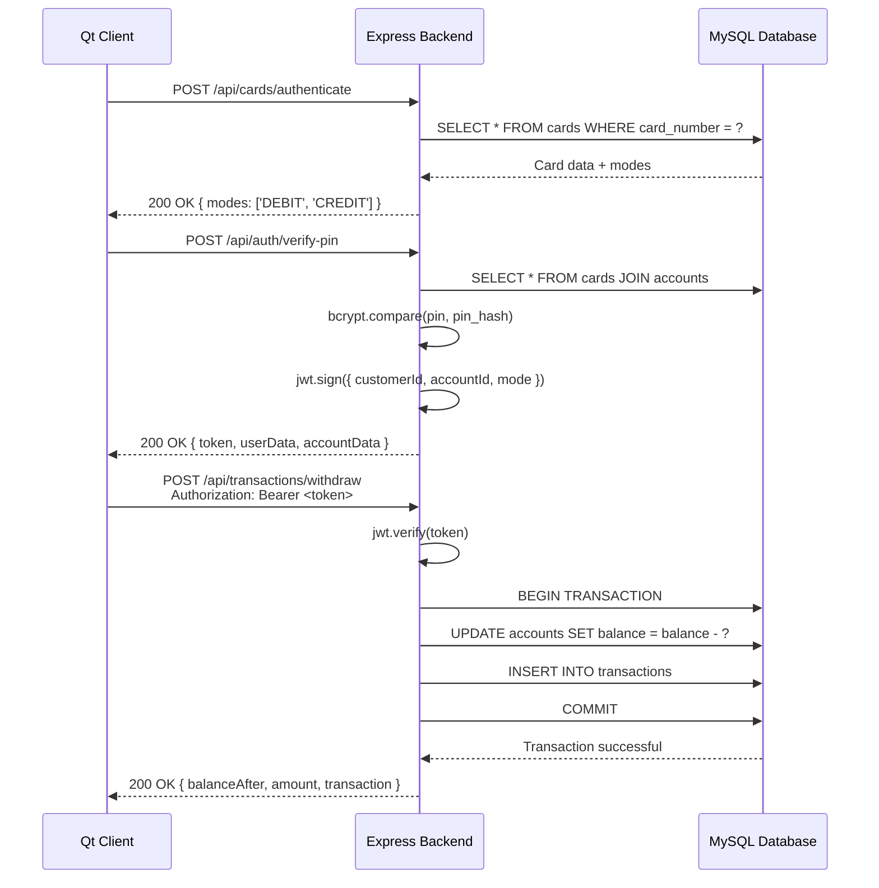
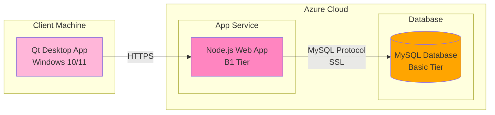

# ATM System - UML Component Diagram

## Overview

This document presents the detailed UML component diagram (Komponenttikaavio) for the Bank ATM System. The diagrams show how system components are implemented through software components, their interfaces, and dependencies.

**Note:** The REST API interface follows OpenAPI 3.0 specification. See `API_REFERENCE.md` for endpoint details.

---

## System Architecture (High-Level)



---

## Frontend Component Architecture (Qt Desktop Client)



### Frontend Component Details

#### **MainWindow Component**
**Responsibilities:**
- Manages UI state and navigation (QStackedWidget)
- Coordinates user interactions across 6 views
- Handles session management and timeout (10s PIN, 30s dashboard)
- Applies pink theme styling (#FFE5EC, #FFB6D9, #FF85C0)

**Provides Interfaces:**
- `void onInsertCardClicked()`
- `void onVerifyPinClicked()`
- `void onBalanceClicked()`
- `void onWithdrawClicked()`
- `void onTransactionClicked()`
- `void onLogoutClicked()`

**Requires Interfaces:**
- `ApiClient::insertCard(cardNumber)`
- `ApiClient::verifyPin(cardNumber, pin, mode)`
- `ApiClient::getTransactionsByAccountId(accountId, token)`
- `ApiClient::withdrawMoney(amount, token)`

**Dependencies:**
- Qt Widgets (QMainWindow, QLabel, QPushButton, QLineEdit, QTableWidget)
- Qt Network (via ApiClient)
- ApiClient component
- TransactionManager component

---

#### **ApiClient Component**
**Responsibilities:**
- HTTP REST API communication with Azure backend
- JWT token management and authentication
- Request/response parsing (JSON)
- Error handling and timeout management

**Provides Signals:**
- `insertCardSuccess(QStringList modes)`
- `verifyPinSuccess(token, userName, customerId, ...)`
- `withdrawSuccess(QJsonObject transaction)`
- `verifyTransactionSuccess(QJsonArray transactions)`
- `errorOccurred(QString message)`

**Provides Methods:**
- `void insertCard(QString cardNumber)`
- `void verifyPin(QString cardNumber, QString pin, QString mode)`
- `void withdrawMoney(double amount, QString token)`
- `void getTransactionsByAccountId(QString accountId, QString token)`
- `void checkHealth()`

**Requires Interfaces:**
- QNetworkAccessManager (HTTP client)
- QJsonDocument (JSON parsing)

**REST API Endpoints Used:**
- `POST /api/cards/authenticate`
- `POST /api/auth/verify-pin`
- `POST /api/transactions/withdraw`
- `GET /api/transactions/account/:id`
- `GET /health`

---

#### **TransactionManager Component**
**Responsibilities:**
- Local transaction data management
- Pagination logic (10 transactions per page)
- Transaction history caching

**Provides Methods:**
- `void setTransactions(QJsonArray)`
- `QJsonArray getTenTransactionsWithPageNumber(int page)`
- `void setCurrentPage(int page)`
- `int getCurrentPage()`
- `int getTotalTransactions()`

**Data Format:**
```json
{
  "transactionType": "WITHDRAW",
  "amount": "50.00",
  "balanceAfter": "440.00",
  "createdAt": "2025-01-20T10:30:00.000Z"
}
```

---

## Backend Component Architecture (Azure Node.js/Express)



### Backend Component Details

#### **Express Application Component**
**Responsibilities:**
- HTTP server management
- Route registration and middleware chain
- Global error handling
- CORS and security configuration

**Provides Interfaces:**
- `GET /health` - Health check endpoint
- `POST /api/cards/authenticate` - Card validation
- `POST /api/auth/verify-pin` - PIN verification + JWT
- `POST /api/transactions/withdraw` - Withdrawal processing
- `GET /api/transactions/account/:id` - Transaction history
- `GET /api/customers` - Customer list (dev/test)

**Configuration:**
- Port: 8080 (Azure App Service)
- CORS: Enabled for Qt client
- Body Parser: JSON (limit: 10mb)
- Logging: Morgan (combined format)

---

#### **JWT Authentication Middleware**
**Responsibilities:**
- Token validation on protected routes
- User context extraction
- Authorization enforcement

**Token Format:**
```javascript
{
  "customerId": "123",
  "accountId": "456",
  "cardMode": "DEBIT",
  "exp": 1674123456 // 1 hour expiry
}
```

**Protected Routes:**
- `/api/transactions/*`
- `/api/accounts/*`

---

#### **Card Service Component**
**Responsibilities:**
- Card number validation
- Card-account relationship lookup
- Available card modes detection (DEBIT/CREDIT)

**Provides Methods:**
- `async authenticateCard(cardNumber)`
  - Returns: `{ modes: ['DEBIT'], cardId, customerId }`
  - Validates: Card exists and is active
  - Queries: `cards`, `accounts`, `card_accounts` tables

---

#### **Auth Service Component**
**Responsibilities:**
- PIN verification (bcrypt comparison)
- JWT token generation
- Account data aggregation

**Provides Methods:**
- `async verifyPin(cardNumber, pin, mode)`
  - Returns: `{ token, userData, accountData, balance }`
  - Validates: PIN hash matches stored hash
  - Generates: JWT with 1-hour expiry
  - Security: Uses bcrypt for PIN comparison

---

#### **Transaction Service Component**
**Responsibilities:**
- Withdrawal processing with balance validation
- Transaction history retrieval
- Database transaction management (ACID)

**Provides Methods:**
- `async processWithdrawal(accountId, amount, customerId, mode)`
  - Validates: Sufficient funds (debit + credit limit)
  - Updates: Account balance (atomic)
  - Records: Transaction log
  - Returns: New balance + transaction details

- `async getTransactionHistory(accountId)`
  - Returns: Array of transactions (newest first)
  - Includes: Type, amount, balance after, timestamp

**Business Rules:**
- DEBIT mode: `balance >= amount`
- CREDIT mode: `balance + creditLimit >= amount`
- All monetary values: DECIMAL(10,2)

---

## Database Schema (Azure MySQL)



### Database Component Details

#### **Tables:**

1. **customers** - Customer master data
2. **cards** - ATM cards with encrypted PINs
3. **card_accounts** - Many-to-many: Card ↔ Account with mode
4. **accounts** - Bank accounts with balance tracking
5. **transactions** - Immutable transaction log

#### **Indexes:**
- `cards.card_number` (UNIQUE) - Fast card lookup
- `accounts.account_number` (UNIQUE) - Account identification
- `transactions.account_id` - Transaction history queries
- `transactions.created_at` - Chronological sorting

#### **Constraints:**
- Foreign keys with CASCADE on delete
- CHECK constraints on balance (>= 0 for DEBIT mode)
- NOT NULL on critical fields (card_number, pin_hash, account_number)

---

## Interface Specifications

### REST API Interface



### Authentication Flow

**JWT Token Structure:**
```json
{
  "customerId": "42",
  "accountId": "100",
  "accountNumber": "FI1234567890",
  "cardMode": "CREDIT",
  "iat": 1674120000,
  "exp": 1674123600
}
```

**Token Lifetime:** 1 hour  
**Token Storage:** In-memory (Qt client)  
**Token Transmission:** `Authorization: Bearer <token>` header

---

## Component Dependencies Matrix

| Component | Depends On | Provides To |
|-----------|-----------|-------------|
| **MainWindow** | ApiClient, Qt Widgets, TransactionManager | User Interface |
| **ApiClient** | QNetworkAccessManager, QJsonDocument | MainWindow |
| **TransactionManager** | QJsonArray | MainWindow |
| **Express App** | Cards/Auth/Transaction Routers, Middleware | HTTP Endpoints |
| **JWT Middleware** | jsonwebtoken library | Protected Routes |
| **Card Service** | MySQL2 Pool | Cards Router |
| **Auth Service** | MySQL2 Pool, bcrypt, jsonwebtoken | Auth Router |
| **Transaction Service** | MySQL2 Pool | Transactions Router |
| **Prisma Client** | Prisma ORM, MySQL | All Services (standard CRUD) |
| **MySQL Pool** | mysql2 library | Transaction Service (stored proc) |

---

## Technology Stack Summary

### Frontend (Qt Desktop Client)
- **Framework:** Qt 6.8.1 (Widgets module)
- **Language:** C++17
- **Build System:** CMake 3.16+ with Ninja
- **Network:** QNetworkAccessManager (HTTPS)
- **JSON:** QJsonDocument, QJsonArray, QJsonObject
- **Compiler:** MSVC 2022 (Windows)

### Backend (Azure App Service)
- **Runtime:** Node.js 20.x
- **Framework:** Express 4.x
- **Authentication:** jsonwebtoken, bcrypt
- **ORM:** Prisma Client (TypeScript-safe queries)
- **Database Access:** Prisma (standard CRUD) + Stored Procedures (withdrawals)
- **Database Driver:** mysql2 (for stored procedure calls)
- **Middleware:** cors, morgan, body-parser

### Database (Azure MySQL)
- **Engine:** MySQL 8.0
- **Charset:** utf8mb4 (Finnish character support)
- **Connection:** SSL/TLS encrypted
- **Backup:** Automated daily backups (Azure)

---

## Security Components

### Frontend Security
- **Session Timeout:** 10s (PIN page), 30s (Dashboard)
- **Token Storage:** In-memory only (no persistence)
- **Input Validation:** PIN length check, amount validation
- **HTTPS:** All API calls use TLS 1.2+

### Backend Security
- **PIN Storage:** bcrypt hashed (cost factor: 10)
- **SQL Injection:** Parameterized queries (mysql2)
- **JWT Signing:** HS256 with secret key (environment variable)
- **CORS:** Whitelist configured for Qt client
- **Rate Limiting:** Future enhancement (not implemented)

### Database Security
- **Connection:** SSL/TLS enforced
- **Access Control:** Service account with minimal privileges
- **Passwords:** Not stored in plaintext (bcrypt)
- **Audit:** Transaction log is immutable (INSERT only)

---

## Deployment Architecture



**Deployment Notes:**
- Qt app: Standalone executable (no installation)
- Azure App Service: Auto-restart on crash
- MySQL: Automated backups (7-day retention)
- Monitoring: Azure Application Insights (future)

---

## Component Interaction Examples

### Example 1: Cash Withdrawal Flow

1. **User clicks €50 quick withdraw button**
   - MainWindow::onQuickWithdraw50() triggered
   
2. **Frontend validation**
   - Check if JWT token exists
   - MainWindow calls ApiClient::withdrawMoney(50.0, token)

3. **API Request**
   - ApiClient sends POST to `/api/transactions/withdraw`
   - Headers: `Authorization: Bearer <JWT>`, `Content-Type: application/json`
   - Body: `{ "amount": 50.0 }`

4. **Backend processing**
   - JWT middleware validates token → extracts accountId
   - Transaction Service checks balance + credit limit
   - Database: BEGIN TRANSACTION
   - Update account balance: `balance = balance - 50.00`
   - Insert transaction record
   - Database: COMMIT

5. **Response handling**
   - Backend returns: `{ balanceAfter: "440.00", amount: "50.00", ... }`
   - ApiClient emits `withdrawSuccess(QJsonObject)`
   - MainWindow updates UI balance label
   - Shows success message to user

---

### Example 2: Transaction History Display

1. **User clicks "Transaction History" button**
   - MainWindow::onTransactionClicked() triggered
   
2. **API Request**
   - ApiClient sends GET to `/api/transactions/account/100`
   - Headers: `Authorization: Bearer <JWT>`

3. **Backend processing**
   - JWT middleware validates token
   - Transaction Service queries database:
     ```sql
     SELECT * FROM transactions 
     WHERE account_id = ? 
     ORDER BY created_at DESC
     ```

4. **Response handling**
   - Backend returns array of transactions
   - TransactionManager caches data
   - MainWindow displays first 10 transactions in QTableWidget
   - Pagination buttons enabled (◄ Previous / Next ►)

---

## Future Component Enhancements

### Planned Components
1. **Cash Dispenser Interface** (hardware integration)
2. **Receipt Printer Component** (transaction receipts)
3. **Biometric Authentication** (fingerprint support)
4. **Multi-language Support** (Finnish/Swedish/English)
5. **Offline Mode Handler** (local transaction queue)

### Technical Debt
- Add rate limiting middleware (backend)
- Implement request retry logic (frontend)
- Add comprehensive logging (Winston logger)
- Database migration system (Flyway/Sequelize)
- Unit test coverage (Jest for backend, Qt Test for frontend)

---

## References

- **API Documentation:** `API_REFERENCE.md`
- **System Flowchart:** `docs/system-flowchart.md`
- **Pink Theme Master Plan:** `PINK_THEME_MASTER_PLAN.md`
- **Test Credentials:** `TEST_CREDENTIALS.md`

**UML Modeling Standard:** UML 2.5  
**Diagram Tool:** Mermaid.js (embedded in Markdown)  
**Last Updated:** 2025-01-20
