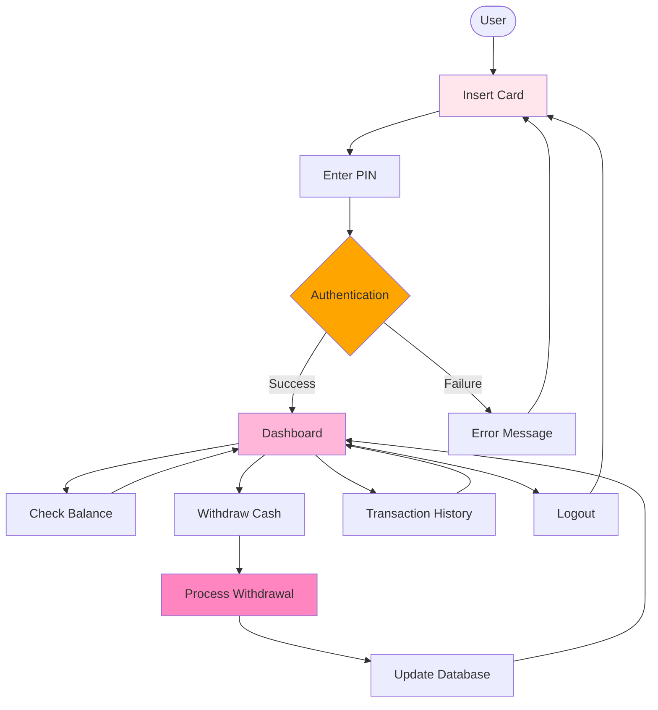
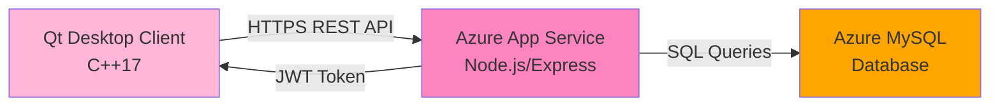
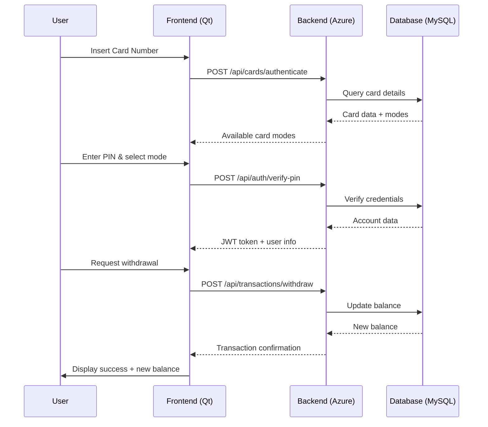

# ATM System Flowchart

## System Architecture

```mermaid
flowchart TB
    User([User]) --> CardInsert[Insert Card]
    CardInsert --> PINEntry[Enter PIN]
    PINEntry --> Auth{Authentication}
    Auth -->|Success| Dashboard[Dashboard]
    Auth -->|Failure| Error[Error Message]
    Error --> CardInsert
    
    Dashboard --> Balance[Check Balance]
    Dashboard --> Withdraw[Withdraw Cash]
    Dashboard --> History[Transaction History]
    Dashboard --> Logout[Logout]
    
    Balance --> Dashboard
    Withdraw --> ProcessWithdraw[Process Withdrawal]
    ProcessWithdraw --> UpdateDB[Update Database]
    UpdateDB --> Dashboard
    History --> Dashboard
    Logout --> CardInsert
    
    style CardInsert fill:#FFE5EC
    style Dashboard fill:#FFB6D9
    style Auth fill:#FFA500
    style ProcessWithdraw fill:#FF85C0
```

## Component Architecture

```mermaid
graph LR
    A[Qt Desktop Client<br/>C++17] -->|HTTPS REST API| B[Azure App Service<br/>Node.js/Express]
    B -->|SQL Queries| C[Azure MySQL<br/>Database]
    B -->|JWT Token| A
    
    style A fill:#FFB6D9
    style B fill:#FF85C0
    style C fill:#FFA500
```

## Data Flow

```mermaid
sequenceDiagram
    participant U as User
    participant F as Frontend (Qt)
    participant B as Backend (Azure)
    participant D as Database (MySQL)
    
    U->>F: Insert Card Number
    F->>B: POST /api/cards/authenticate
    B->>D: Query card details
    D-->>B: Card data + modes
    B-->>F: Available card modes
    
    U->>F: Enter PIN & select mode
    F->>B: POST /api/auth/verify-pin
    B->>D: Verify credentials
    D-->>B: Account data
    B-->>F: JWT token + user info
    
    U->>F: Request withdrawal
    F->>B: POST /api/transactions/withdraw
    B->>D: Update balance
    D-->>B: New balance
    B-->>F: Transaction confirmation
    F->>U: Display success + new balance
```
