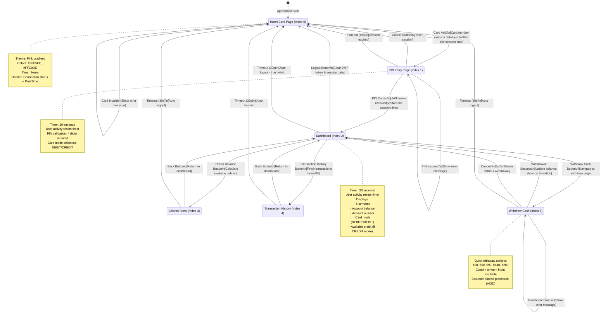
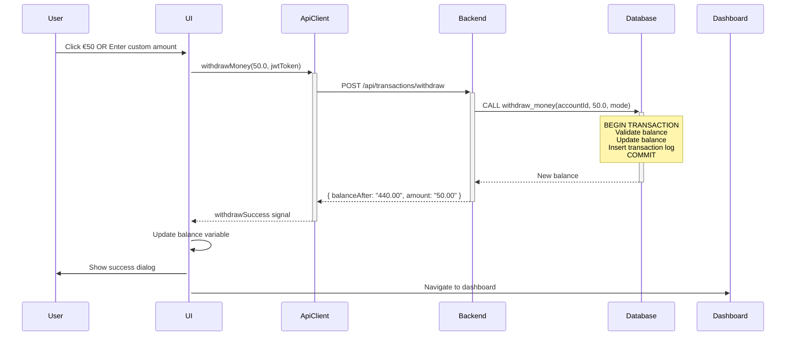

# Käyttöliittymän Kuvaus / User Interface Description

Tämä dokumentti kuvaa ATM-sovelluksen käyttöliittymän rakenteen, tilat ja tilasiirtymät.

This document describes the ATM application's user interface structure, states, and state transitions.

---

## Tilakaavio / State Diagram

Tilakaaviossa kuvataan käyttöliittymän toiminta pääpiirteissään. Sovellus käyttää Qt QStackedWidget-komponenttia näkymien hallintaan, ja jokaisella näkymällä on oma tilansa.

The state diagram illustrates the main operation of the user interface. The application uses Qt QStackedWidget component for view management, and each view has its own state.



---

## Tilojen Kuvaukset / State Descriptions

### 1. Insert Card Page (Aloitussivu) - Index 0

**Tarkoitus / Purpose:**  
Sovelluksen aloitusnäkymä, jossa käyttäjä syöttää korttinumeron.

Starting view of the application where the user enters the card number.

**UI-elementit / UI Elements:**
- Title: "♥ Welcome to ATM"
- Input field: Card number (16 digits)
- Button: "INSERT CARD ►" (pink gradient)
- Error label: Shows validation errors
- Header: Connection status indicator + DateTime

**Toiminnallisuus / Functionality:**
- Validates card number exists in database (via ApiClient)
- On success: Receives available card modes (DEBIT/CREDIT)
- On error: Shows error message ("Card not found or blocked")
- No session timer active (waiting state)

**Tilasiirtymät / State Transitions:**
- → PIN Entry: Card validation successful
- → Insert Card: Card validation failed (stays on page, shows error)

**Styling:**
```css
Background: Pink gradient (#FFE5EC → #FFC9DE)
Input field: #FFF0F5, border #FFB6D9
Button: Gradient (#FFB6D9 → #FF85C0)
Error text: #E91E63 (14pt Segoe UI Bold)
```

---

### 2. PIN Entry Page (PIN-vahvistus) - Index 1

**Tarkoitus / Purpose:**  
PIN-koodin syöttö ja vahvistus sekä korttimuodon valinta.

PIN code entry and verification, plus card mode selection.

**UI-elementit / UI Elements:**
- Title: "Enter PIN"
- Input field: PIN (4-digit masked input)
- ComboBox: Card mode selector (DEBIT/CREDIT)
- Button: "VERIFY PIN ✓" (pink gradient)
- Button: "✕ CANCEL" (outlined pink)
- Error label: Shows PIN validation errors
- Session timer: Visible in header (10s countdown)

**Toiminnallisuus / Functionality:**
- **Session timer:** 10 seconds (any user activity resets timer)
- PIN validation: Must be exactly 4 digits
- Card mode must be selected from available modes
- On success: Receives JWT token + user data (username, account balance, credit limit)
- On timeout: Automatic return to Insert Card page

**Tilasiirtymät / State Transitions:**
- → Dashboard: PIN verification successful (JWT token received)
- → PIN Entry: PIN verification failed (stays on page, shows error)
- → Insert Card: Cancel button clicked OR session timeout (10s)

**Session Management:**
```javascript
// Timer starts when card validation succeeds
startSessionTimer(10); // 10 seconds

// User activity events that reset timer:
- PIN input field text edited
- Card mode selection changed
- Verify button clicked
```

**Styling:**
```css
PIN input: Masked password field, pink theme
ComboBox: Pink dropdown with custom arrow
Error text: #E91E63
Session timer: Displayed in header (top-right)
```

---

### 3. Dashboard (Päävalikko) - Index 2

**Tarkoitus / Purpose:**  
Päävalikko, josta käyttäjä voi valita haluamansa toiminnon.

Main menu where the user selects the desired operation.

**UI-elementit / UI Elements:**
- User info display:
  - Username (16pt bold)
  - Account balance (20pt)
  - Account number (12pt)
  - Card mode badge (DEBIT/CREDIT, 14pt)
  - Credit limit (if CREDIT mode)
- Action buttons (secondary style):
  - 💰 Check Balance
  - 📜 Transaction History
  - 💵 Withdraw Cash
- Logout button: 🚪 Logout (cancel style)
- Session timer: Visible in header (30s countdown)

**Toiminnallisuus / Functionality:**
- **Session timer:** 30 seconds (any user activity resets timer)
- Displays available balance based on card mode:
  - **DEBIT mode:** Shows only account balance
  - **CREDIT mode:** Shows three lines:
    - Debit balance
    - Credit limit
    - Available total (balance + credit limit)
- JWT token stored for authenticated API calls
- Auto logout on timeout

**Tilasiirtymät / State Transitions:**
- → Balance View: "Check Balance" button
- → Transaction History: "Transaction History" button
- → Withdraw Cash: "Withdraw Cash" button
- → Insert Card: "Logout" button OR session timeout (30s)

**Session Management:**
```javascript
// Timer starts when PIN verification succeeds
startSessionTimer(30); // 30 seconds

// User activity events that reset timer:
- Any button click
- Any page navigation
```

**Balance Display Logic:**
```javascript
if (cardMode == "CREDIT") {
    displayBalance = 
        "Debit " + balance + "€\n" +
        "Credit Limit " + creditLimit + "€\n" +
        "Available " + (balance + creditLimit) + "€";
} else {
    displayBalance = balance + "€";
}
```

**Styling:**
```css
Username: #B85C8A (16pt bold)
Balance: #9D4E6F (20pt)
Card mode badge: #FF85C0 (14pt bold)
Action buttons: Outlined pink style
Logout button: Pink border, transparent background
```

---

### 4. Balance View (Saldon tarkastelu) - Index 3

**Tarkoitus / Purpose:**  
Tilin saldon yksityiskohtainen näyttö.

Detailed account balance display.

**UI-elementit / UI Elements:**
- Title: "Your Balance" (18pt bold)
- Balance display label (24pt):
  - DEBIT mode: Single balance line
  - CREDIT mode: Three lines (Debit, Credit Limit, Available)
- Back button: "← BACK" (returns to dashboard)
- Session timer: Visible in header (30s countdown)

**Toiminnallisuus / Functionality:**
- Same balance calculation as dashboard
- Static display (no API call needed - data already cached)
- User activity (navigation) resets session timer

**Tilasiirtymät / State Transitions:**
- → Dashboard: "Back" button
- → Insert Card: Session timeout (30s)

**Styling:**
```css
Title: #B85C8A (18pt bold)
Balance text: #9D4E6F (24pt bold)
Alignment: Top-left (better readability for multi-line)
Back button: Outlined pink style
```

---

### 5. Transaction History (Tapahtumahistoria) - Index 4

**Tarkoitus / Purpose:**  
Tilin tapahtumahistorian näyttö sivutettuna (10 tapahtumaa per sivu).

Account transaction history display with pagination (10 transactions per page).

**UI-elementit / UI Elements:**
- QTableWidget: Transaction table with columns:
  - Type (WITHDRAW/DEPOSIT)
  - Amount
  - Balance After
  - Date (yyyy-MM-dd HH:mm:ss format)
- Pagination buttons:
  - "◄ Previous" (secondary style)
  - "Next ►" (secondary style)
- Back button: "← BACK" (returns to dashboard)
- Error label: Shows API errors
- Session timer: Visible in header (30s countdown)

**Toiminnallisuus / Functionality:**
- Fetches transaction history via API on page load
- JWT token required (authenticated endpoint)
- Pagination managed by TransactionManager component
- 10 transactions per page
- Date parsing: ISO 8601 → Finnish format
- User activity (pagination clicks) resets session timer

**Tilasiirtymät / State Transitions:**
- → Dashboard: "Back" button
- → Insert Card: Session timeout (30s)

**Data Flow:**
```javascript
1. Page loads → apiClient.getTransactionsByAccountId(accountId, jwtToken)
2. Backend response → objTransactions.setTransactions(transactions)
3. Display page 1 → setTenTransactionsToTable(1)
4. User clicks "Next" → currentPage++, display next 10 transactions
5. User clicks "Previous" → currentPage--, display previous 10 transactions
```

**Table Styling:**
```css
Table background: rgba(255, 255, 255, 200)
Border: 2px solid #FFB6D9
Header row: #FF85C0 background, white text
Selected row: #FFB6D9 background
Row height: 40px minimum (prevents row number clipping)
Columns: Stretch to fill width
```

---

### 6. Withdraw Cash (Nostotoiminto) - Index 5

**Tarkoitus / Purpose:**  
Käteisnoston suoritus pikavalinnoilla tai käyttäjän syöttämällä summalla.

Cash withdrawal with quick selections or custom amount.

**UI-elementit / UI Elements:**
- Input field: Custom amount (€) - optional
- Quick withdraw buttons (5 buttons, pink gradient):
  - €20
  - €50
  - €90
  - €140
  - €200
- Submit button: "WITHDRAW ✓" (primary style)
- Cancel button: "← CANCEL" (returns to dashboard)
- Error label: Shows validation/insufficient funds errors
- Session timer: Visible in header (30s countdown)

**Toiminnallisuus / Functionality:**
- **Quick withdraw:** Instant withdrawal with predefined amounts
- **Custom amount:** User enters amount manually
- Input validation:
  - Amount must be > 0
  - Amount must be numeric
- Backend validation:
  - DEBIT mode: `balance >= amount`
  - CREDIT mode: `balance + creditLimit >= amount`
- Backend uses **stored procedure** (`withdraw_money`) for ACID guarantees
- On success:
  - Updates local balance variable
  - Shows confirmation dialog
  - Returns to dashboard
- User activity (amount input, button clicks) resets session timer

**Tilasiirtymät / State Transitions:**
- → Dashboard: Withdrawal successful OR cancel button
- → Withdraw Cash: Insufficient funds (stays on page, shows error)
- → Insert Card: Session timeout (30s)

**Withdrawal Flow:**


**Quick Withdraw Buttons Styling:**
```css
Background: Gradient (#FFB6D9 → #FF85C0)
Text: White, bold 14pt
Border radius: 20px
Height: 50px minimum
Hover: Gradient (#FF85C0 → #FF5CAA)
Pressed: #FF5CAA solid
```

**Error Handling:**
- Invalid amount: "Invalid amount" (displayed in error label)
- Empty input: "Please enter amount"
- Insufficient funds: "Insufficient funds for withdrawal" (from backend)

---

## Session Management (Istunnon hallinta)

### Session Timer Behavior

**PIN Entry Page:**
- Duration: 10 seconds
- Purpose: Prevent PIN shoulder-surfing
- Starts: When card validation succeeds
- Resets: On any user activity (PIN input, card mode selection, button click)
- Expires: Auto logout → return to Insert Card page

**Dashboard & All Sub-pages:**
- Duration: 30 seconds
- Purpose: Secure ATM session timeout
- Starts: When PIN verification succeeds
- Resets: On any user activity (button clicks, input, navigation)
- Expires: Auto logout → return to Insert Card page

**User Activity Events (Reset Timer):**
```cpp
// Connected to onUserActivity() slot:
- PIN input text edited
- Card mode combobox changed
- All button clicks (verify, balance, transaction, withdraw, etc.)
- Withdraw amount input
- Quick withdraw button clicks
- Navigation button clicks (back, next, previous)
```

**Session Timeout Dialog:**
```plaintext
Title: "Session Timeout"
Message: "Your session has expired due to inactivity. 
          Please insert your card again."
Button: OK
Action: Return to Insert Card page, clear all session data
```

**Session Data Cleared on Logout/Timeout:**
```cpp
jwtToken.clear();
currentCardNumber.clear();
balance.clear();
creditLimit.clear();
cardMode.clear();
accountId.clear();
accountNumber.clear();
username.clear();
customerId.clear();
objTransactions.setTransactions(QJsonArray()); // Clear transaction cache
```

---

## Header Bar (Persistent Across All Pages)

**Elements:**
- **Left:** Connection status indicator (● Online/● Offline/● Checking...)
  - Green (#4CAF50): Backend connected
  - Red (#F44336): Backend offline
  - Orange (#FFA500): Checking connection
- **Center:** Current date/time (Finnish format: dd.MM.yyyy HH:mm)
  - Updates every 1 second
- **Right:** ATM serial number ("ATM #4000")
- **Right (conditional):** Session timer countdown ("Session: 30s")
  - Visible only on PIN page and Dashboard+ pages

**Header Layout:**
```
[● Online]  [Spacer]  [20.01.2025 15:30]  [Spacer]  [Session: 28s]  [ATM #4000]
```

**Background:** Transparent (shows through pink gradient from MainWindow)

**Connection Status Polling:**
- Interval: Every 30 seconds
- Endpoint: `GET /health`
- Purpose: Wake up Azure App Service from sleep mode + verify connectivity

---

## Pink Theme (Vaaleanpunainen teema)

**Color Palette:**
```css
/* Main background gradients */
#FFE5EC → #FFC9DE (Main window diagonal gradient)

/* Pink theme colors */
Primary: #FFB6D9 (Light pink)
Secondary: #FF85C0 (Medium pink)
Accent: #FF5CAA (Dark pink)
Text primary: #B85C8A (Pink-brown)
Text secondary: #9D4E6F (Dark pink-purple)
Badge/highlight: #FF85C0 (Medium pink)
Error: #E91E63 (Pink-red)

/* Input fields */
Background: #FFF0F5 (Very light pink)
Border: #FFB6D9
Focus border: #FF85C0 (3px)

/* Buttons */
Primary: Gradient (#FFB6D9 → #FF85C0)
Secondary: Outlined #FFB6D9, transparent background
Hover: Gradient (#FF85C0 → #FF5CAA)
Pressed: #FF5CAA solid

/* Table */
Background: rgba(255, 255, 255, 200) (semi-transparent white)
Border: #FFB6D9
Header: #FF85C0 background
Selected row: #FFB6D9 background
```

**Typography:**
- Font family: Segoe UI
- Sizes:
  - Title: 18-22pt bold
  - Body text: 12-14pt
  - Data display: 16-24pt bold
  - Buttons: 12-14pt semi-bold/bold
  - Error messages: 11-14pt bold

**Spacing & Layout:**
- Border radius: 15-27px (rounded corners)
- Padding: 8-24px (depends on element)
- Margins: 10-40px (vertical spacing between elements)
- Button height: 50px minimum

---

## Navigation Summary (Navigointitaulukko)

| From State | To State | Trigger | Condition |
|------------|----------|---------|-----------|
| Insert Card | PIN Entry | Insert Card button | Card exists in database |
| PIN Entry | Dashboard | Verify PIN button | PIN correct, JWT received |
| PIN Entry | Insert Card | Cancel button | User cancels |
| PIN Entry | Insert Card | Timeout (10s) | Session expired |
| Dashboard | Balance View | Check Balance button | None |
| Dashboard | Transaction History | Transaction History button | None |
| Dashboard | Withdraw Cash | Withdraw Cash button | None |
| Dashboard | Insert Card | Logout button | User logs out |
| Dashboard | Insert Card | Timeout (30s) | Session expired |
| Balance View | Dashboard | Back button | None |
| Transaction History | Dashboard | Back button | None |
| Withdraw Cash | Dashboard | Withdrawal success | Backend validates & processes |
| Withdraw Cash | Dashboard | Cancel button | User cancels |
| All authenticated pages | Insert Card | Timeout (30s) | Session expired |

---

## API Integration (Backend-yhteystiedot)

**Base URL:**  
`https://bank-atm-backend-h5bybufaegbnbvaf.swedencentral-01.azurewebsites.net`

**Endpoints Used by UI:**

| Endpoint | Method | Page | Purpose |
|----------|--------|------|---------|
| `/health` | GET | All (header) | Connection status check (30s interval) |
| `/api/cards/authenticate` | POST | Insert Card | Validate card number |
| `/api/auth/verify-pin` | POST | PIN Entry | Verify PIN + get JWT token |
| `/api/transactions/withdraw` | POST | Withdraw Cash | Process withdrawal (stored procedure) |
| `/api/transactions/account/:id` | GET | Transaction History | Fetch transaction history |

**Authentication:**
- JWT token received on PIN verification
- Token format: Bearer token in Authorization header
- Token lifetime: 1 hour
- Token payload: `{ customerId, accountId, cardMode, exp }`

---

## Error Handling (Virheiden käsittely)

**Error Display Strategy:**
- Page-specific error labels (different labels for different pages)
- Insert Card page: `errorLabel`
- PIN Entry page: `errorLabel_2` and `pinErrorLabel`
- Withdraw page: `withdrawErrorLabel`
- Transaction History page: `transactionErrorLabel`

**Common Error Messages:**

| Error | Displayed On | Message |
|-------|-------------|---------|
| Card not found | Insert Card | "Card not found or blocked" |
| Card blocked | Insert Card | "Card status: BLOCKED" |
| Invalid PIN | PIN Entry | "Invalid PIN" (from backend) |
| PIN length incorrect | PIN Entry | "Pin must be 4 numbers" (client-side validation) |
| No card mode selected | PIN Entry | "Select a card mode" |
| Insufficient funds | Withdraw Cash | "Insufficient funds for withdrawal" |
| Invalid amount | Withdraw Cash | "Invalid amount" (client-side validation) |
| Empty amount | Withdraw Cash | "Please enter amount" |
| Session timeout | All authenticated pages | "Your session has expired due to inactivity" |
| Network error | Any page | API error message from backend |

**Error Styling:**
```css
Color: #E91E63 (pink-red)
Font: 600-700 11-14pt Segoe UI Bold
Background: Transparent
Padding: 5-10px
Text alignment: Center (most pages)
Word wrap: Enabled (for long messages)
```

---

## Accessibility Features (Saavutettavuus)

**Current Implementation:**
- UTF-8 support for Finnish characters (ä, ö, €)
- Keyboard navigation supported (Tab, Enter)
- Error messages clearly visible (large font, contrast color)
- Session timer countdown visible to user
- Clear button labels with emojis (💰, 📜, 💵, 🚪)

**Future Enhancements:**
- Screen reader support
- High contrast mode
- Larger font size option
- Audio feedback for visually impaired users

---

## Technical Implementation Notes

**UI Framework:**
- Qt 6.8.1 Widgets
- QStackedWidget for page management
- QMainWindow as main container

**Session Timers:**
- QTimer (single-shot for timeout)
- QTimer (recurring 1s for countdown display)
- User activity signals connected to reset function

**Data Flow:**
- ApiClient handles all HTTP communication
- Signals/slots for async API responses
- TransactionManager for local pagination
- JWT token stored as QString in MainWindow

**Performance:**
- Health check polling: 30 seconds (non-blocking)
- DateTime update: 1 second (low overhead)
- Session timer update: 1 second (countdown display)
- Transaction pagination: Client-side (no API calls for navigation)

---

## Viitteet / References

- **Component Diagram:** See `docs/component-diagram.md`
- **Component Descriptions:** See `docs/component-descriptions.md`
- **Pink Theme Master Plan:** See `PINK_THEME_MASTER_PLAN.md`
- **API Documentation:** See `API_REFERENCE.md`
- **Test Credentials:** See `TEST_CREDENTIALS.md`

**Dokumentti päivitetty / Document Updated:** 2025-01-20
